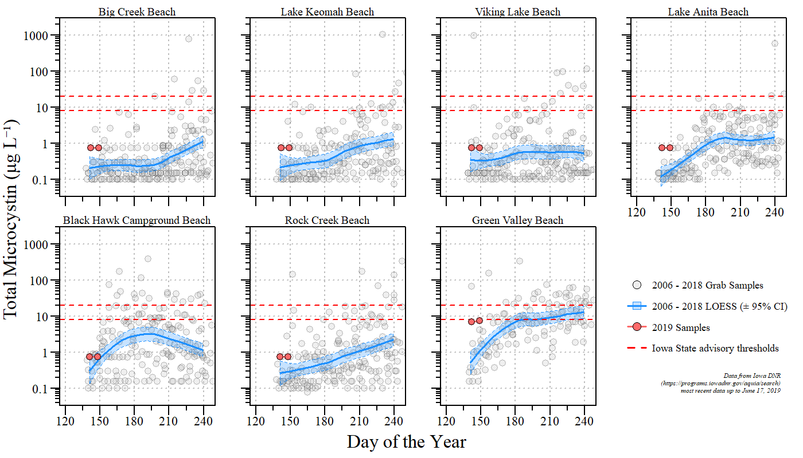
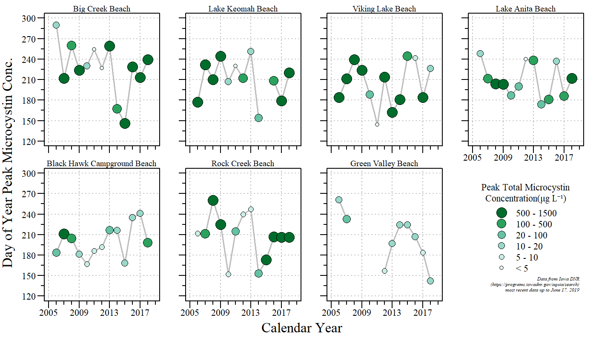
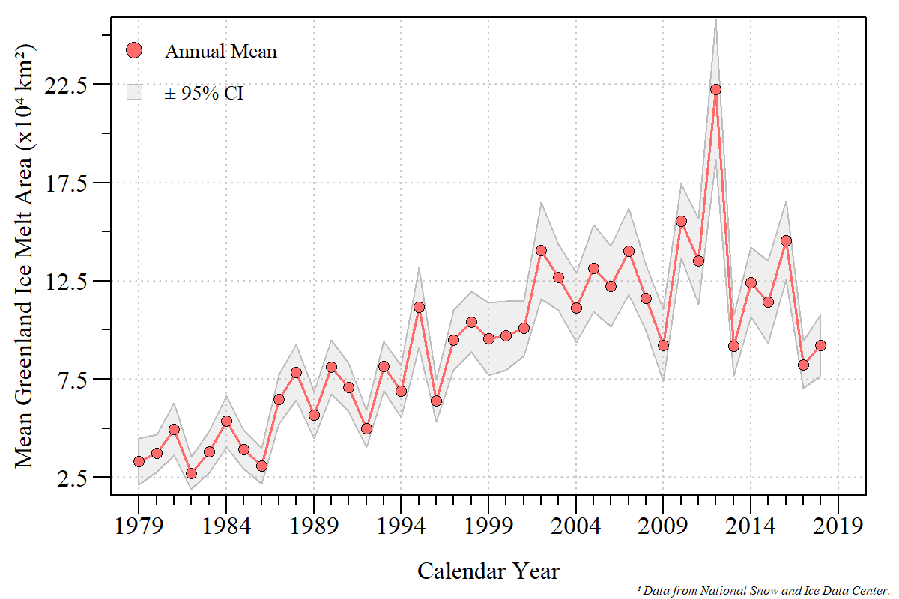
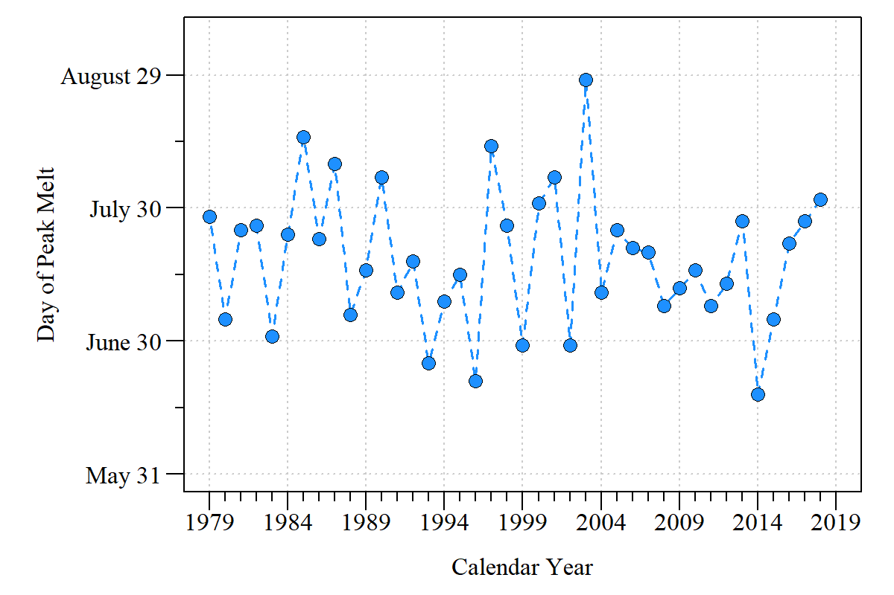

# Ecology Data Viz (previously Ecology _#TidyTuesday_)

Much like [TidyTuesday](https://github.com/rfordatascience/tidytuesday), Eco-Data Viz is in the spirit of TidyTuesday focusing on working with ecological data in the R-environment with an emphassis on summarizing and displaying ecological data to a broader audience. All are welcome to join in the fun. This is an ever evolving repo, check back soon for new additions.

## Contact
Paul Julian - [Webpage](http://swampthingecology.org) - [Twitter](https://twitter.com/SwampThingPaul) - [Email](mailto:pauljulianphd@gmail.com)

## Description/contents
 - `Data/`: Additional data files not provided in self contained R-scripts.
 - `Plots/`: Figures generated by R-scripts. 
 - `scripts/`: R-scripts used to generate plots/DataViz products.
 - Other files : associated GitHub and R-project files.

## Data 

| Date (Tuesday) | Week Number | Data Source | Data location |
|:---:|:-----:|:----|:------|
| [2019-06-18](#20190618) |<!--format(as.Date("2019-06-18"),"%V")`-->25| [Iowa DNR AQuIA](https://programs.iowadnr.gov/aquia/search) | [queryResults.csv](./Data/20190618/)|
| [2019-06-25](#20190625) |<!--format(as.Date("2019-06-25"),"%V")`-->26| [NSIDC](http://nsidc.org/greenland-today/) | [Online Extracted using _rJSON_](https://nsidc.org/greenland-today/greenland-surface-melt-extent-interactive-chart/)|
| 2019-07-01 |<!--format(as.Date("2019-06-25"),"%V")`-->27| --- | No Data |
| 2019-07-09 |28| [Polar Science Center](http://psc.apl.uw.edu/research/projects/arctic-sea-ice-volume-anomaly/) |  Pan-Arctic Ice Ocean Modeling and Assimilation System Sea |

***

### 2019-06-18 (Iowa Lake Microcystin Concentration)

Q1 Is the #cyanoHAB season starting earlier this year (2019) than the past 13 year period?
 
 

 Top seven highest observed historic #microcystin concentrations in Iowa. Looks like some are starting the season with a bang. #HABs.

 
 

Q2 Has peak microcystin concentrations shifted to earlier in the year over the 13-year period of record?
 
 

Has the annual maximum and timing of the peak Microcystin changed over time in Iowa's top seven highest #microcystin lakes for the 13 years?

***

### 2019-06-25 (Greenland Surface Melt Extent)

1. Replicate [Greenland Daily Melt Plot](https://nsidc.org/greenland-today/)

Calendar year 2019 Greenland surface melt extent relative to the 1979 to 2018 period of record.

 
 
Q1 Has the average trend in Greenland melt area increased?

Annual average Greenland melt area with 95% confidence interval for calendar year 1979 to 2018. The annual average has significantly increased over this period of record (Kendall Trend analysis: $\tau$ = 0.62; $\rho$ <0.01).

 
 
Q2 Has the peak melt area increased during the period of record?

Day of max melt area between calendar year 1979 to 2018. 

***
