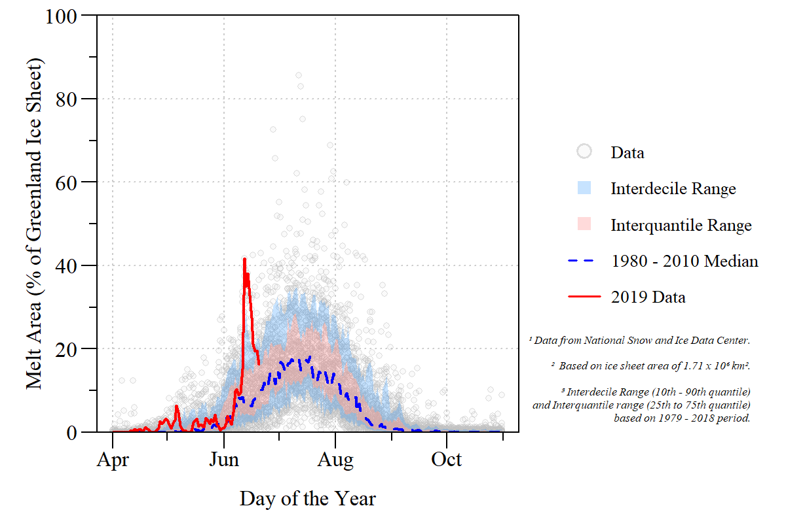
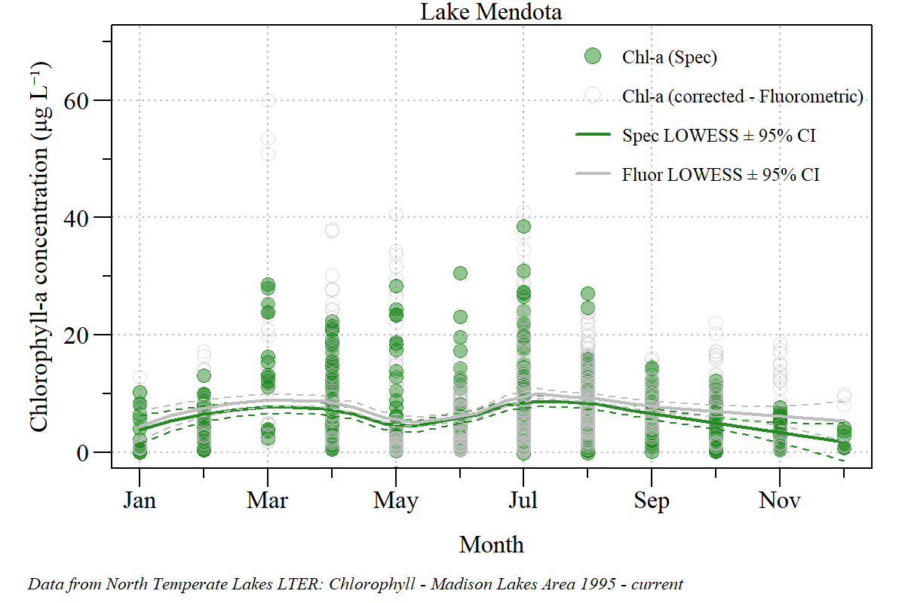

# Ecology Data Viz (previously Ecology _#TidyTuesday_)

Much like [TidyTuesday](https://github.com/rfordatascience/tidytuesday), Eco-Data Viz is in the spirit of TidyTuesday focusing on working with ecological data in the R-environment with an emphasis on summarizing and displaying ecological data to a broader audience. All are welcome to join in the fun. This is an ever evolving repo, check back soon for new additions.

## Contact
Paul Julian - [Webpage](http://swampthingecology.org) - [Twitter](https://twitter.com/SwampThingPaul) - [Email](mailto:pauljulianphd@gmail.com)

## Description/contents
 - `Data/`: Additional data files not provided in self contained R-scripts.
 - `Plots/`: Figures generated by R-scripts. 
 - `scripts/`: R-scripts used to generate plots/DataViz products.
 - Other files : associated GitHub and R-project files.

## Data 

| Date (Tuesday) | Week Number | Data Source | Data location |
|:---:|:-----:|:----|:------|
| [2019-06-18](#20190618) |<!--format(as.Date("2019-06-18"),"%V")`-->25| [Iowa DNR AQuIA](https://programs.iowadnr.gov/aquia/search) | [queryResults.csv](./Data/20190618/)|
| [2019-06-25](#20190625) |<!--format(as.Date("2019-06-25"),"%V")`-->26| [NSIDC](http://nsidc.org/greenland-today/) | [Online Extracted using _rJSON_](https://nsidc.org/greenland-today/greenland-surface-melt-extent-interactive-chart/)|
| 2019-07-01 |<!--format(as.Date("2019-06-25"),"%V")`-->27| --- | No Data |
| [2019-07-09](#20190709) |28| [Polar Science Center](http://psc.apl.uw.edu/research/projects/arctic-sea-ice-volume-anomaly/) |  [PIOMAS](http://psc.apl.uw.edu/research/projects/arctic-sea-ice-volume-anomaly/data/) |
| [2019-09-17](#20190917) | 38 | [NSIDC](https://nsidc.org/arcticseaicenews/)| Online via FTP (ftp://sidads.colorado.edu/DATASETS/NOAA/G02135/) | 
| [2019-09-28](#20190928)| 39 | [SFWMD](https://my.sfwmd.gov/dbhydroplsql/show_dbkey_info.main_menu) | [airtemp.csv](./Data/20190928/)|
| [2019-12-09](#20191209)| 50 | [NTL LTER](https://lter.limnology.wisc.edu/node/54999) |[ntl38_v4.csv](./data/20191209)|

***

### 2019-06-18 (Iowa Lake Microcystin Concentration)

Q1 Is the #cyanoHAB season starting earlier this year (2019) than the past 13 year period?
 
 

 Top seven highest observed historic #microcystin concentrations in Iowa. Looks like some are starting the season with a bang. #HABs.

 
 

Q2 Has peak microcystin concentrations shifted to earlier in the year over the 13-year period of record?
 
 

Has the annual maximum and timing of the peak Microcystin changed over time in Iowa's top seven highest #microcystin lakes for the 13 years?

***

### 2019-06-25 (Greenland Surface Melt Extent)

1. Replicate [Greenland Daily Melt Plot](https://nsidc.org/greenland-today/)

Calendar year 2019 Greenland surface melt extent relative to the 1979 to 2018 period of record.

 
 
Q1 Has the average trend in Greenland melt area increased?

Annual average Greenland melt area with 95% confidence interval for calendar year 1979 to 2018. The annual average has significantly increased over this period of record (Kendall Trend analysis: &tau; = 0.62; &rho; <0.01).

 
 
Q2 Has the peak melt area increased during the period of record?

Day of max melt area between calendar year 1979 to 2018. 

 

Associated detailed blog post with all the code and information can be found [here](https://swampthingecology.org/blog/june-25-2019-eco-dataviz/).

***

### 2019-07-09 (Arctic Sea Ice Volume)

Using the Pan-Arctic Ice Ocean Modeling and Assimilation System ([PIOMAS](http://psc.apl.uw.edu/research/projects/projections-of-an-ice-diminished-arctic-ocean/)) data you can explore sea-ice thickness and volume changes throughout the years. Data used in this instance is located in the ["Data"](./Data/20190709/) folder.

Daily changes in Arctic sea-ice volume and thickness over a 41 year period (1979 - 2019) using data from the Polar Science Center [PIOMAS Arctic Sea Ice Volume Reanalysis](http://psc.apl.uw.edu/research/projects/arctic-sea-ice-volume-anomaly/) project. 

`R`-script can be found at [this link](./scripts/20190709_EcoDataViz.R). 

Associated detailed blog post with all the code and information can be found [here](https://swampthingecology.org/blog/july-9-2019-eco-dataviz/).

***

### 2019-09-17 (Arctic Sea Ice Extent)

Using data from the Defense Meteorological Satellite Program and Special Sensor Microwave Imager/Sounder the National Snow and Ice Data Center can estimate sea-ice extent for both Arctic and Antarctic regions of interest. 

Daily changes in Arctic sea-ice extent for 2019 relative to the 1981 - 2010 period of record and the period of record minimum extent (2012) using data from the National Snow & Ice Data Center [ChArctic](https://nsidc.org/arcticseaicenews/about-charctic-data/) program. 

`R`-script can be found at [this link](./scripts/20190917_EcoDataViz.R). 

***

### 2019-09-28 (Southwest Florida Chill Hours)

Recently I started a project on our property (some progress [pics](https://www.instagram.com/p/B3QBgYkAXOz/?utm_source=ig_web_copy_link)) to put in an apple orchard and native wildflower area. Being in Florida you typically don't think of apples being able to be grown here however a few apple cultivars can successfully be grown in Florida. These cultivars are known as [low-chill apples](https://edis.ifas.ufl.edu/mg368) and require what is known as chilling requirements or the amount of cold temperatures during a period of time. This is known as chill hours or the cumulative umber of hours less than 7o C. To understand the potential chill hours we experience in our garden I used data from three of the closest inland weather stations maintained by the South Florida Water Management District for the past 10-years, determined the annual chill hours and computed the upper 95% confidence interval. Based on this analysis we should be able to get enough chill hours to get an apple harvest from our trees once they are ready...assuming the climate doesn't get warmer.

Annual (based on Florida water year; May to Apirl) chill hours for inland weather sites within South Florida maintained by the South Florida Water Management District. Data period of record covers May 2008 to Apirl 2019. 

`R`-script can be found at [this link](./scripts/20190928_EcoDataViz.R). 

***

### 2019-12-09 (Lake Mendota Chlorophyll seasonality)

After seeing this twitter [post](https://twitter.com/hildug/status/1204059990241218560?s=20) by [Dr Hilary Dugan](https://dugan.limnology.wisc.edu/) I got curious about the seasonality in chlorophyll-a concentrations within Lake Mendota. Chlorophyll-a concentrations can be used to assess the algal biomass within a given body of water. High chlorophyll-a concentrations can be indicative a an algal bloom. However, this metric does not indicate if it is a nuisance or Harmful Algal Bloom. 

Monthly chlorophyll-a concentration estimated by spectrophotometric (green dots) and fluorometric methods with seasonal locally weighted least squares with upper and lower 95% confidence intervals. 

***